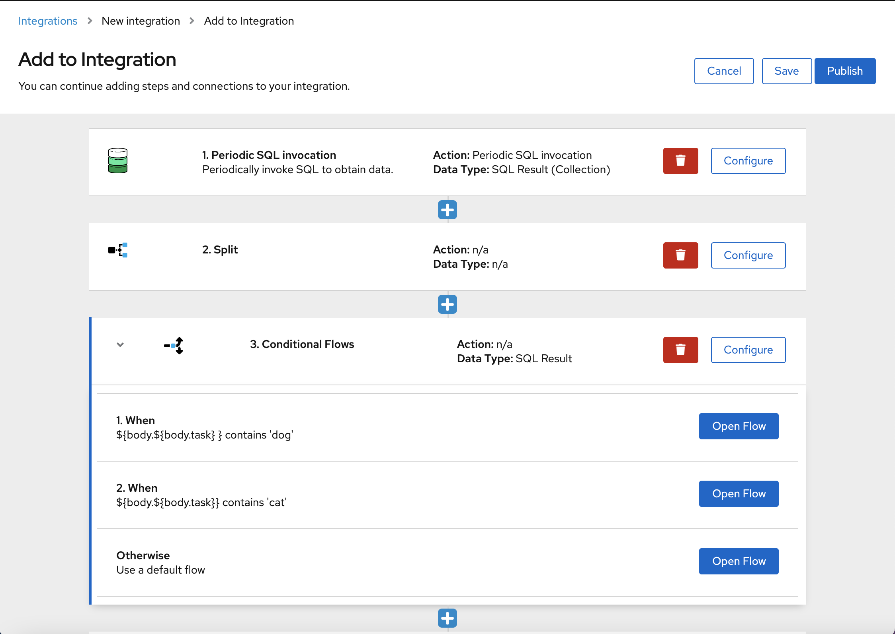
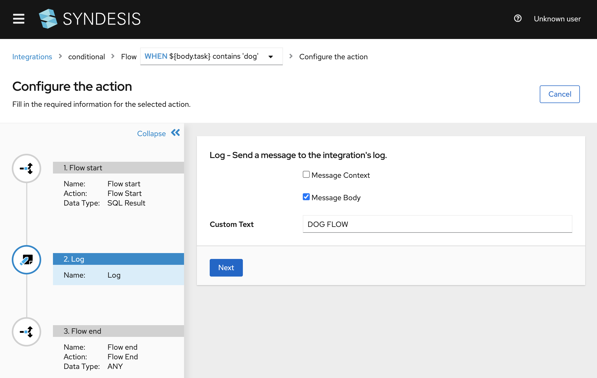

# API Provider with FTP

## Introduction
In this scenario we demonstrate how to use conditional flows.

## Screencast of this Quickstart

Link to a screencast of this quickstart on our youtube channel:

*`<<Click to Play>>`*

*Figure 1. Endpoints in the File API*

## Getting Started

Here we describe using the export so you can get a feel for how things work quickly. If you want to set up your own flows you can follow the video tutorial from above. In the Syndesis UI navigate to `Integrations` and click on the `Import` button in the right top corner. Now you can select the [conditional-export.zip](conditional-export.zip?raw=true) file and start the import. 

You can start create a db-2-log flow, using `Select * from todo`. Next, add a splitter so that each record turns into message as conditional flows work on single messages. After the splitter is inserted you can now add a `Condition Flow`.

*Figure 1. Adding Splitter and Conditional Flows*

Create a condition for `task contains dog` and `task contains cat` as well as a default flow.

*Figure 2. Main Flow with subflows*

*Figure 3. Subflow*

## What did we learn?
* We learned to use the Splitter
* We learned to use Conditional Flows
