# API-Provider to MongoDB

## Introduction
MongoDB connector allows you to use this NoSQL database in your integrations. For this quickstart scenario we'll show how to read and write data from a MongoDB collection. We'll also see how to tail a collection and be able to trigger an integration when a new document is stored in a collection.

## REST API backed by a MongoDB collection

In the first scenario we will create a simple REST API defined by [this OpenAPI specification](sample.json). We want an endpoint to store game information, and one to read those information. A similar scenario was described in the [API Provider quickstart](https://github.com/squakez/syndesis-quickstarts/tree/master/api-provider), but backed by a conventional SQL database instead.

Before starting with Syndesis steps, let's connect to our MongoDB instance and create the collection where we store the data.

```
db.createCollection("game", {
   validator: {
      $jsonSchema: {
         bsonType: "object",
         required: [ "code", "name", "genre", "year" ],
         properties: {
            code: {
              bsonType: "string"
            },
            name: {
               bsonType: "string"
            },
            year: {
               bsonType: "string"
            },
            language: {
              bsonType: "string"
            },
            genre: {
              bsonType: "string"
            }
         }
      }
   }
})
```
We are enforcing a schema with the `validator` feature offered by MongoDB. This is extremely important as it is the only way to let Syndesis know which is the expected document format.

Let's move to Syndesis now. The first thing we have to do is to create a connection to the MongoDB instance we want to use. In my example it's represented by a local instance run by Minishift.

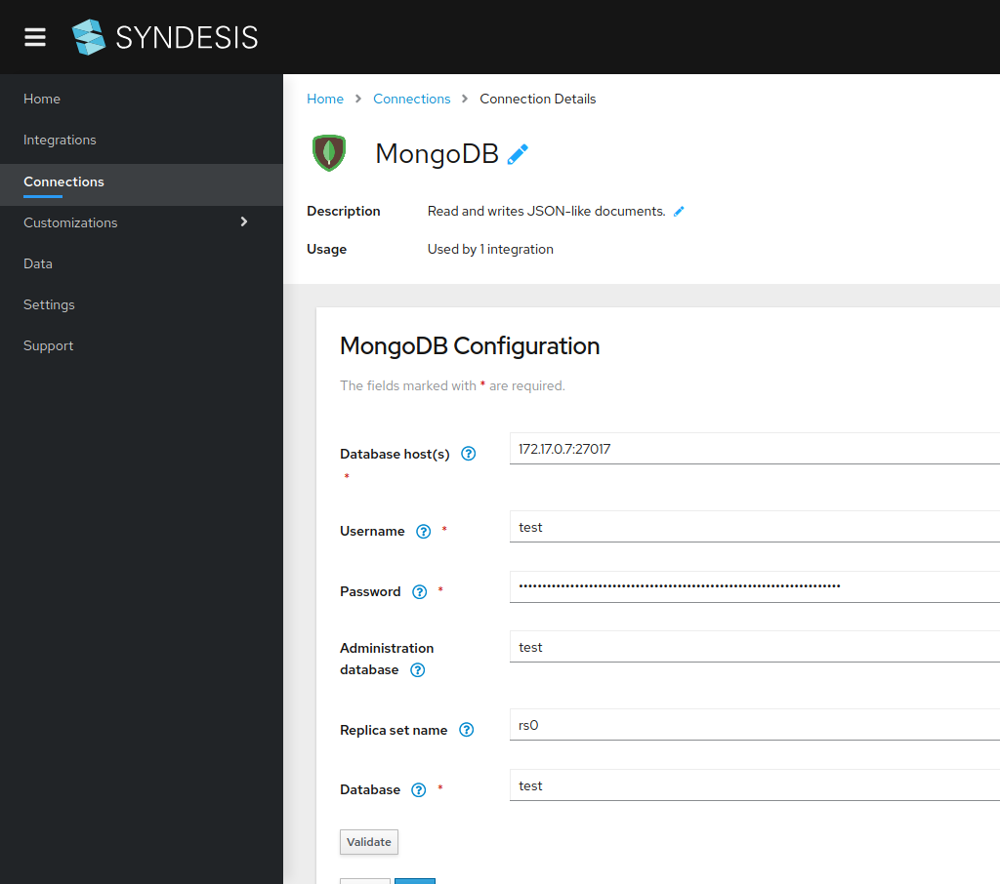

*Figure 1. Connecting to MongoDB instance*

Once the connection is ready, we will start an integration creating a new API Provider. In the example we're providing a local file, but you can use the url to [sample.json](sample.json) directly.
  
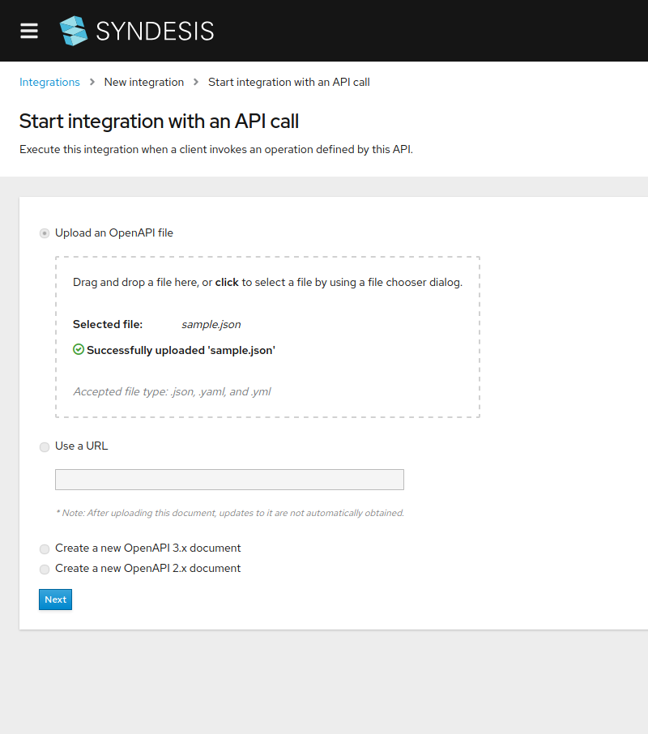

*Figure 2. Configuring the OpeanAPI specification*

The previous action will parse the content of the specification and will show you the endpoints expected. You must select each _Create flow_ to define each individual action.

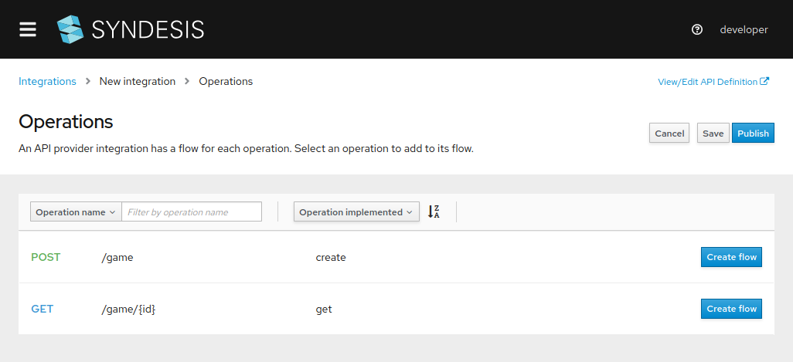

*Figure 3. Review the operations available*

Let's start with the `GET` operation. Each step (x) will be explained in detail. 

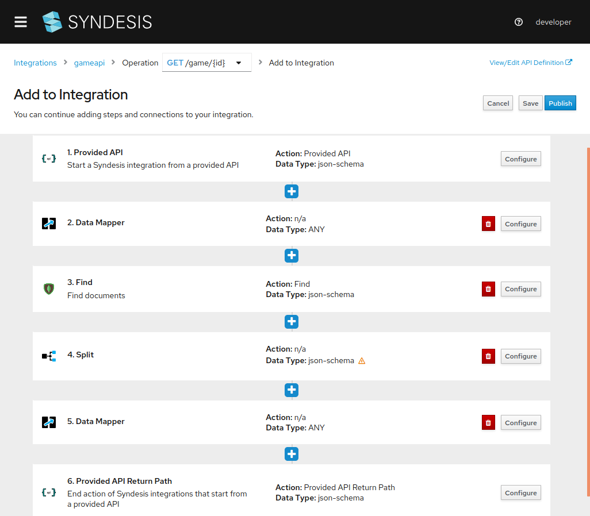

*Figure 4. Configuring `GET` operation*

We'll need to use a `find` operation on the MongoDB to recover the contents identified by the `id` parameter (3). Here we must specify the collection where to read the documents and the filter expression. The filter expression can have variables parameters expressed by the notation `:#variable`. They will be dynamically replaced at runtime.

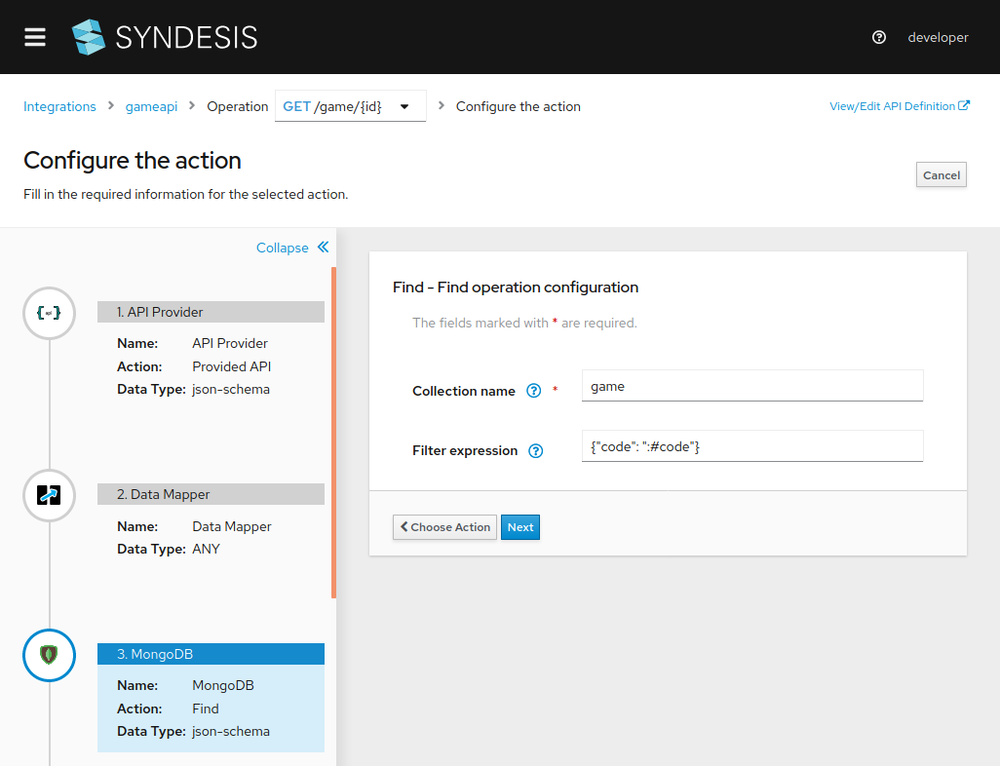

*Figure 5. MongoDB `find`*

At this stage we need to map (2) the `:#code` variable introduced in the filter with the `id` parameter coming from the API specification.

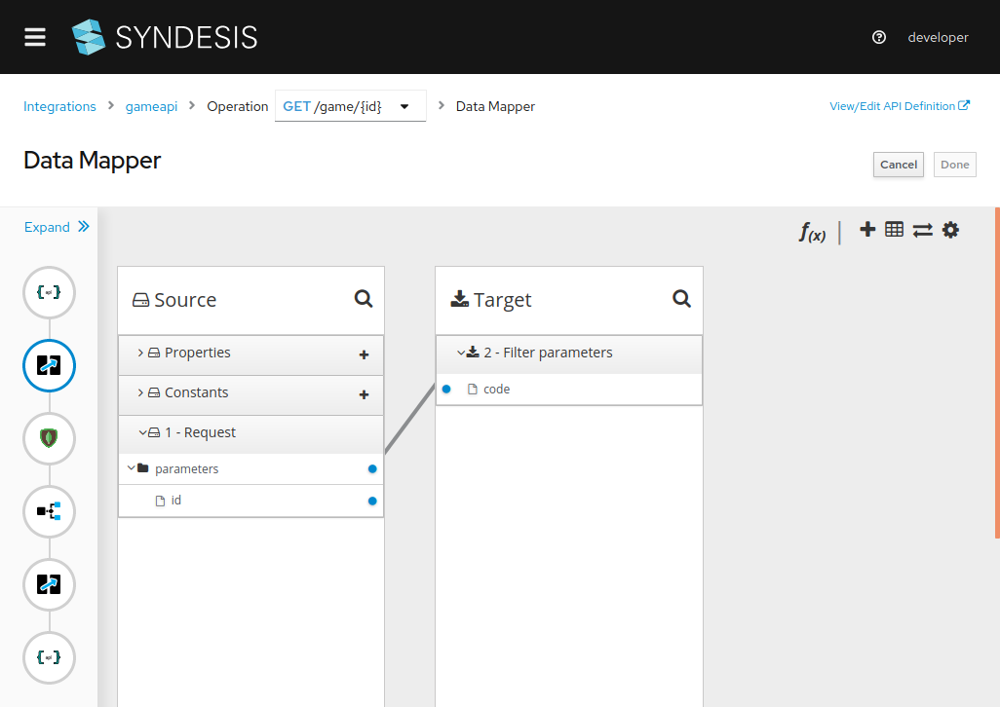

*Figure 6. Mapping `code` field with `id` parameter*

As the find operation is returning a `List` we need to add a `Split` step (4) to treat each document separately. Finally we need to add another mapping (5) in order to match the expected API output with the structure defined in the collection.

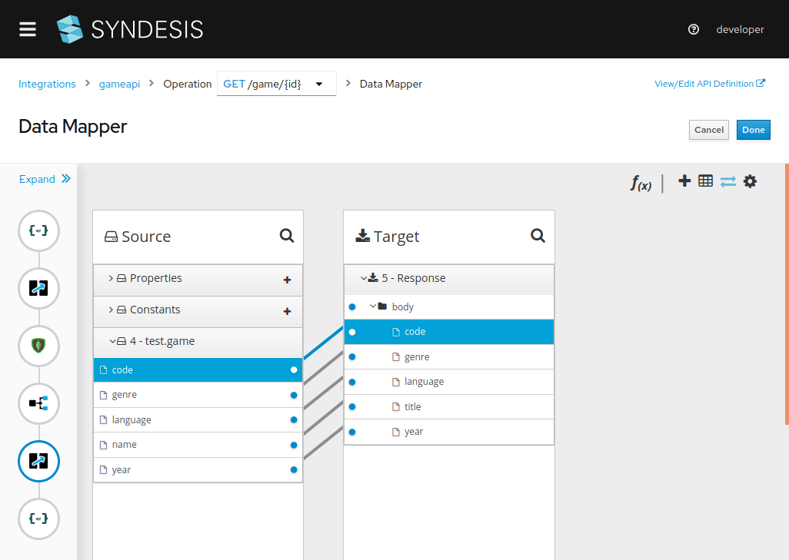

*Figure 7. Mapping result with expected output*

We're done with the `GET` operation. Let's now open the `POST` operation flow.

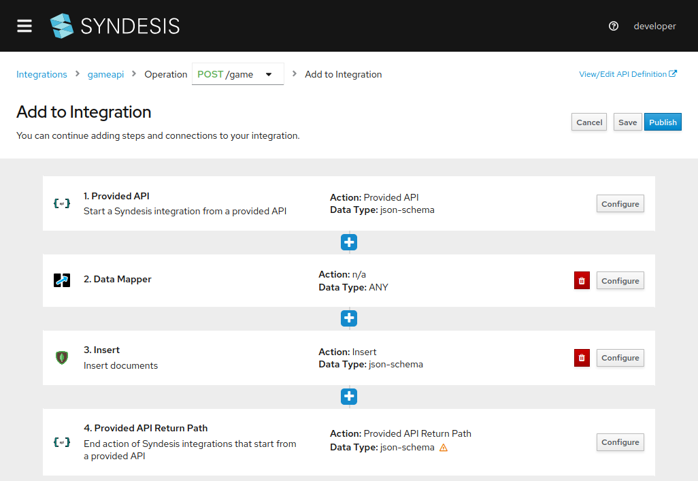

*Figure 8. Configuring `POST` operation*

It will be backed by an `insert` MongoDB operation (3). We only have to configure the collection. As the data structure of the API differs from the one of the collection, we're required to add a data mapper step (2) too.

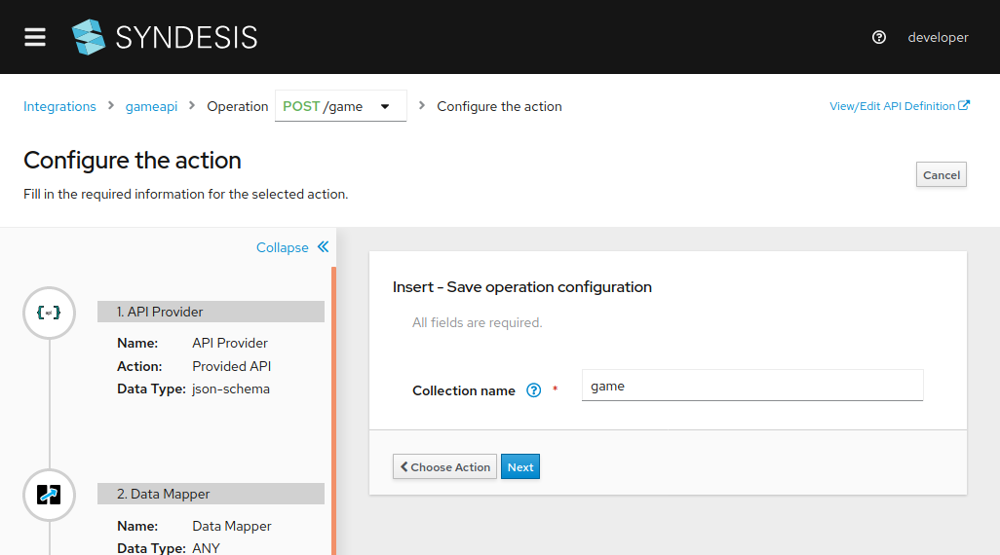

*Figure 9. MongoDB insert*

This is it. We can now publish our integration and make some test.

Let's start by creating a new game. The output is how it appears in MongoDB.
```
$ http POST https://i-gameapi-myproject.192.168.42.139.nip.io/game/ code="DOOM" genre="action" title="Doom" year="1993" language="english" --verify=no

{
    "_id": {
        "$oid": "5e58d4ae005c8e0001f95e69"
    },
    "code": "DOOM",
    "genre": "action",
    "language": "english",
    "name": "Doom",
    "year": "1993"
}
```
We can now call the `GET` endpoint to read the information just published.
```
$ http https://i-gameapi-myproject.192.168.42.139.nip.io/game/DOOM --verify=no

{
    "code": "DOOM",
    "genre": "action",
    "language": "english",
    "title": "Doom",
    "year": "1993"
}
```
You can see that the operation correctly return the information with the structure specified!

## Streaming MongoDB collection documents

MongoDB recent versions introduced a very cool feature called [`Change Stream`](https://docs.mongodb.com/manual/changeStreams/). Resuming, you can receive notification about data introduced in a collection and use it as it is a stream of documents.

Let's create an integration to show how it applies to Syndesis. To make it simple, for this quickstart we're just logging the documents added to the `game` collection defined in the previous integration. For more complex scenario you can thing to replace the `Log` step with any datasource and use this stream of data.

We start an integration with a MongoDB source. We're required to choose either a `change stream` or a `tail` operation. We select the first one.

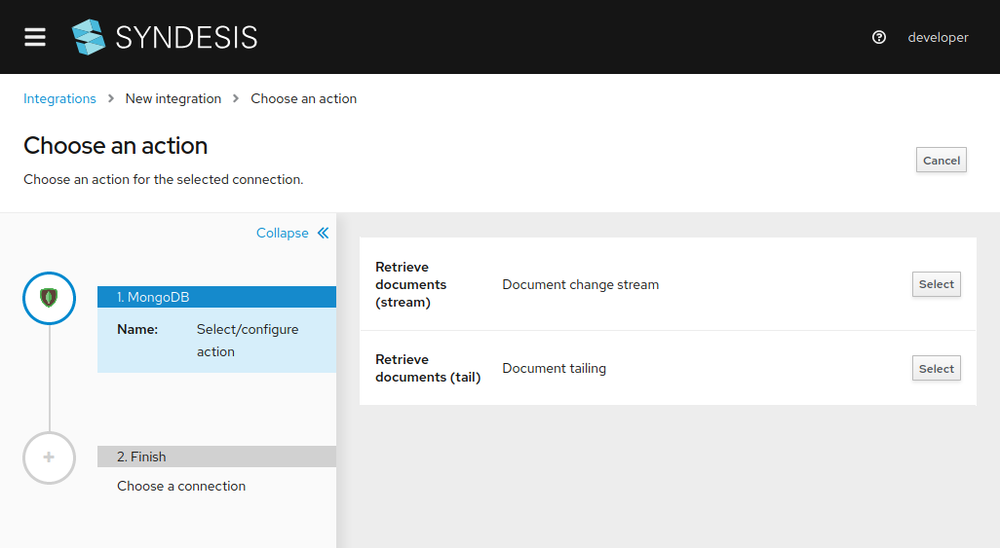

*Figure 10. MongoDB change stream*

We provide the collection we want to watch.

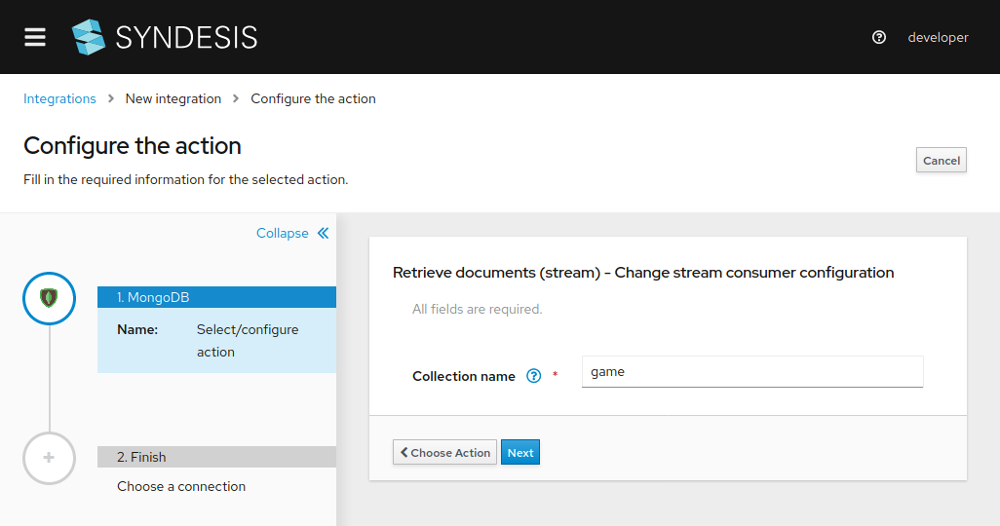

*Figure 11. Configuring the collection*

As a destination we select a `Log` step.

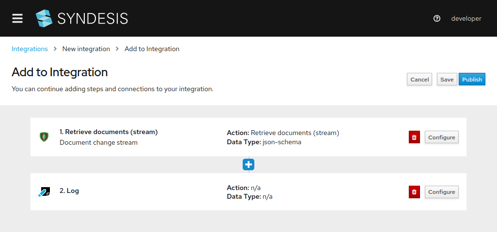

*Figure 11. MongoDB to Log integration*

Done. Easy, right? Then, let's publish and create some game using the API done previously.

```
$ http POST https://i-gameapi-myproject.192.168.42.139.nip.io/game/ code="DOOM2" genre="action" title="Doom 2" year="1994" language="english" --verify=no
$ http POST https://i-gameapi-myproject.192.168.42.139.nip.io/game/ code="MONKEY" genre="adventure" title="The Secret of Monkey Island" year="1992" language="english" --verify=no
...
```

Let's have a look at the activity log and see what is happening

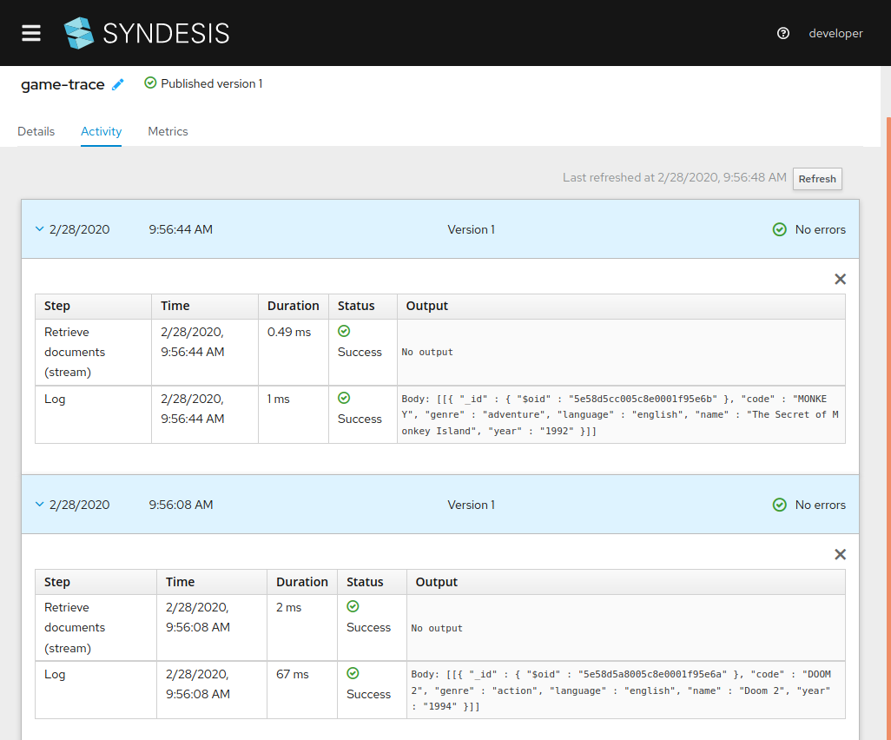

*Figure 13. MongoDB to Log integration log*

Here you are: the games you've created are notified as soon as they are added to the collection.

## What did we learn?
* We learned to generate a REST API backed by a MongoDB database
* We learned to watch a MongoDB collection

